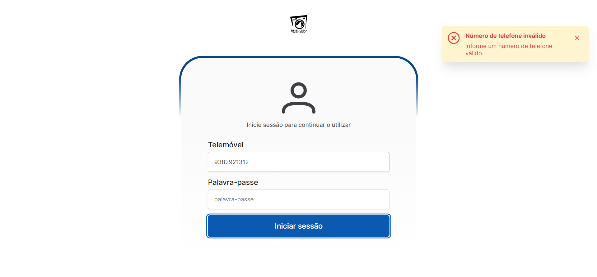
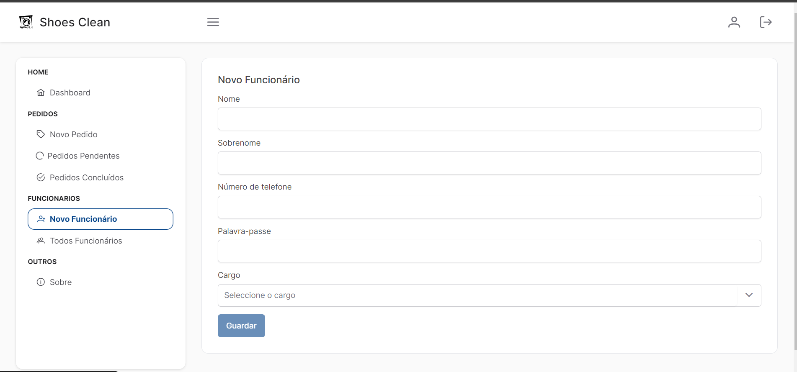
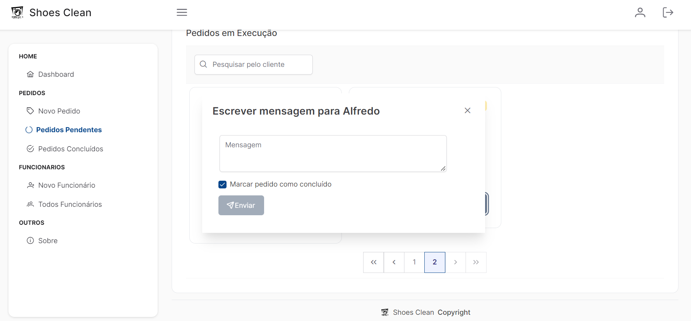
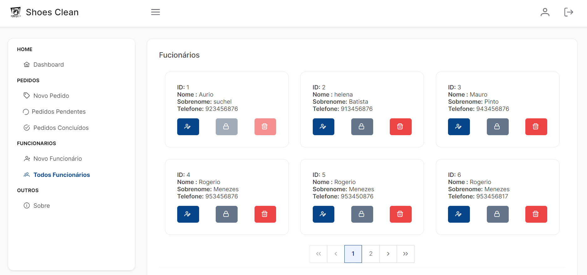
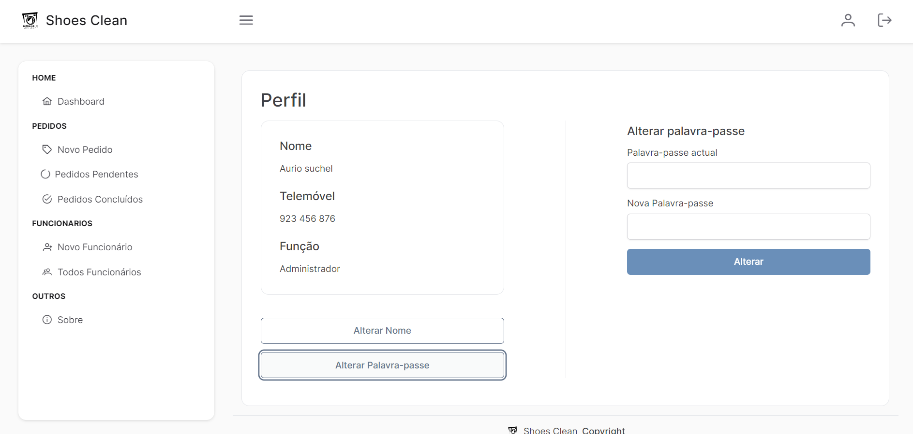
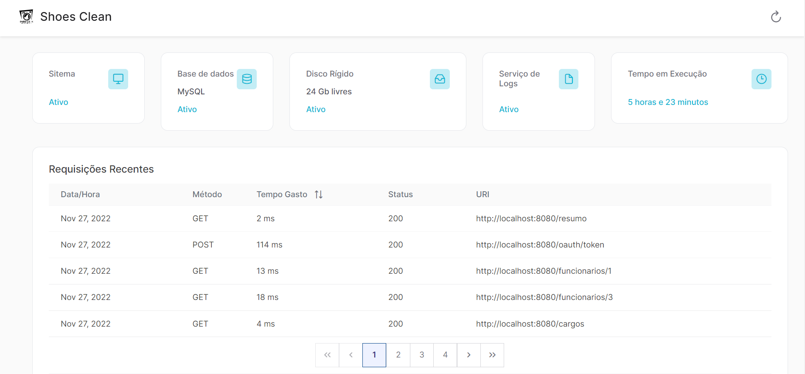

## This repository is the frontend part of my production-ready aplication that allowses management
of orders and costumer notification on shoes clean company.

###### the project has been divided in following functionalities modules:

#Workers Module

1.List workers

2.Create worker

3.Edit worker

4.Block worker

5.Delete Worker ** [Must have Admin role]** 

6.Block user ** [Must have Admin role]** 

#Profile Module

1.Edit name

2.Alter password

#Orders

1.List orders.

2.Filter orders

3.Search orders from client number or name

4.Create order

5.Finish order

6.Finish or with custom notification message

7.Send Message to client

# Some core functionalities

1.Login

2. Logout

3. Redirection to login when token expires

4. Responsive design suitable for most devices

<h3> Screenshots: <h3>

 
    
    
    
    
  
  

